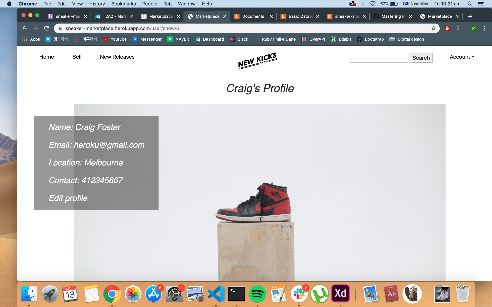
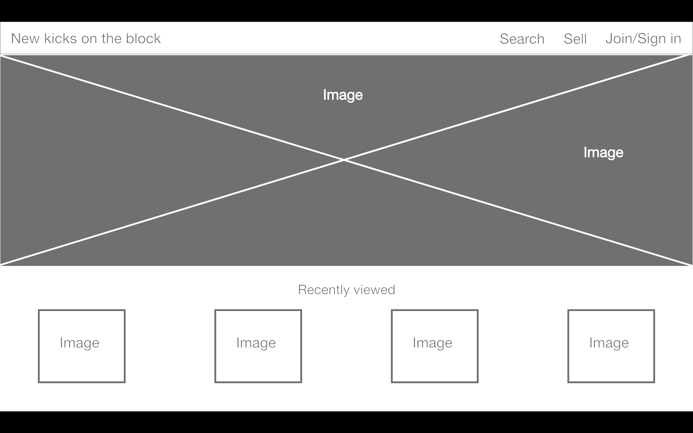
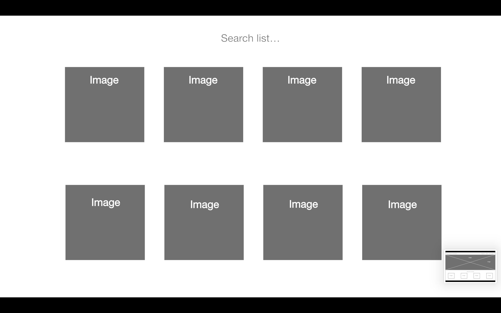

# README

### Identification of the problem you are trying to solve by building this particular marketplace app and why it needs solving.

Compared to America there are little to none sneaker reselling marketplaces present in Australia. For those sneakerheads living in Australia wanting to purchase a pair of premium sneakers that aren't available in Australia are more than likely to go the extra yard and purchase sneakers overseas and along with that a large sum in international shipping fees. With the Australian exchange rate plummeting at an all time low purchasing a pair of sneakers in America can be a bit overwhelming and financially difficult. 

### Heroku 
https://sneaker-marketplace.herokuapp.com/

### Github 
https://github.com/phillipyoo/sneaker_marketplace

#### Purpose
Knowing that products are now available Australian sneakerheads can easily browse and sell sneakers and see what's available on the website. Creating a consumer-to-consumer(C2C) marketplace app will hopefully build a strong presence amongst sneakerhead communities in Australia.

#### Features

1. Users will be able to browse the latest sneakers that have been posted online by seller themselves. However buyers can only add an item once they have registered an account.  
2. Users can upload a pair of sneakers they are willing to sell by filling up a form requiring details about the shoe itself before uploading it onto the market. The form will only accept a listed order of brands in so that it keeps the market authentic and unique.   
3. Registered users can go into their account and check their wishlist whenever they'd like to revisit an item. Sellers can also do somethng similar by going into account and checking their sneaker posts in listings. 
4. If a buyer would like to enquire about a pair of kicks they can send a message to the seller through an internal user messaging system.
5. Admin user is capable of overlooking all registered users and can choose to block a user if they turn out to be a scammer or caught selling fakes.

### Sitemap

### Screenshots

### Target Audience
The target audience is a majority of sneakerheads based in Australia who want to save the trouble of purchasing goods from overseas. 

### Tech Stack
* html
* css
* ruby on rails
* heroku
* github

### User stories 

| As a  | I want to | So that I  |
| ------------- |:-------------:| -----:|
| CEO     | create an app | can save the trouble of consumers coming instore |
| CEO      | create an online marketplace   |   expand my business |
| Sneakerhead | purchase sneakers online  | don't have wait to in line to buy limited edition sneakers    |
| Reseller | sell a pair of sneakers  |   can make a profit out of it |
| Sneakerhead | buy sneakers | collect premium sneakers |
| Social media influencer | buy a pair of sneakers | can showcase them on social media |
| Parent| buy a pair of sneakers for my kid's birthday| can surprise him |
| Underground rapper |  buy a pair of sneakers  |  wear it at my concert |

### Wireframes 

### ERD

### Schema design

### Explain the different high-level components in your app
The most complex component implemented into the application is building an administration account. A new column called "admin" is assigned a boolean value and added into "user" tables. A user can be assigned as an admin if `user.admin` is valued true. The rest of the users are given a default value of false. Then a generated controller for admin allows Admin to create views that looks different to what users normally see on the app. 

``user.block = !(user.block)``

Admin has been given the right to block or unblock users if necessary. In order for this function to work a new column names "block" is assigned a default boolean value of false to all users in the table. The code above allows Admin to block users through querying `users.block` value to true. The feature functions the other way around if `!users.block` query value back to false if user is unblocked.  

### Detail any third party services that your app will use
Integrating a devise authentication API on rails creates a User that can login and out of the application. Devise uses 10 modules to configure user authentication and 6 of which are enabled by default:
* Database Authenticable
* Rememberable
* Recoverable
* Registerable
* Trackable
* Validatable

``

    <%= link_to "Home", root_path, class: 'link-to-text-color %>
        <%if user_signed_in?%>
    <%= link_to "Sell", new_sneaker_path, class: 'link-to-text-color' %>
    <%end%>

``

The code above will only allow user access to the ``Sell`` section once it verifies if the ``users_signed_in``to the application. If users are not signed in the link to the page will not be displayed. 

### Describe your projects models in terms of the relationships they have with each other

``Users``
* can sell and buy many sneakers in the marketplace
* can have many items(sneakers) in wishlist 
* can have many listed items
* can have many conversations with other registered users

``Wishlist & Listings``
* belongs to a user with many sneakers listed on the platform and added in wishlist 

``Sneaker``
* has one attached picture everytime a user posts a pair of sneakers to the market

``Conversation & Messages``
* there are many messages that can belong in a conversation with a user 
* conversations belongs to a recipient and sender 

### Discuss the database relations to be implemented in your application

`User_id's` are passed into sneaker table as a foreign key where `sneaker_id` is then further called to listing table when a user posts a pair of sneakers onto the market.

If users choose to store a pair of sneakers into the wishlist the `sneaker_id` is passed into wishlist as a foreign key `wishlist_id`.

Users can internally message each other via conversations. For the recipient and sender's conversation to be co-existent bother user's `user_id ` needs to be passed through in order for the function to work.

### Describe the way tasks are allocated and tracked in your project

